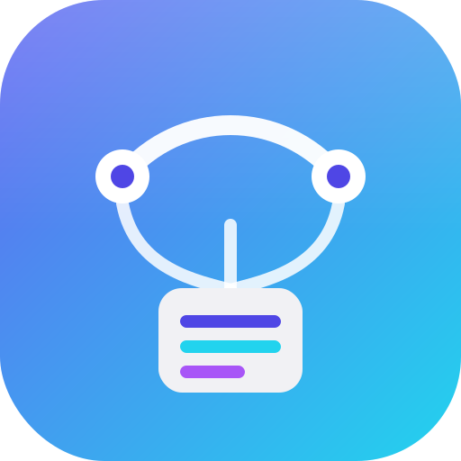
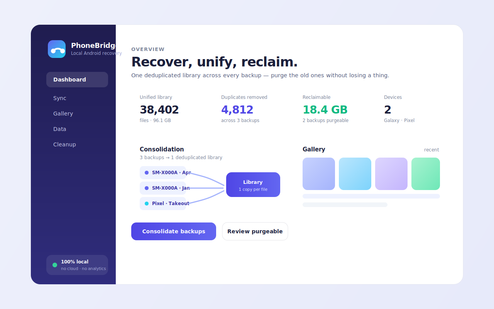

<div align="center">



# PhoneBridge

**Consolidate every phone backup into one deduplicated library — and reclaim the rest.**

Local-first desktop app to recover, unify, and explore Android phone data. Your photos, videos, audio,
contacts, messages, notes, and calendar from every backup — merged once, deduplicated by content, with
full provenance so you can safely purge the old backups.

[](LICENSE)




</div>

---

## The problem

You back up your phone — SmartSwitch, a folder copy, an export — and it's great. Then you do it again.
And again. Each backup **re-copies** photos, videos, and audio that were already in the last one. After a
few rounds you have **overlapping backups eating tens of GB**, and no idea which one is safe to delete or
what you removed in between. It becomes a mess.

## The idea

PhoneBridge merges all your backups into **one library**, deduplicated **by content** (not by filename or
path), and remembers **where every file came from**. Once a backup is fully represented in the library,
PhoneBridge tells you it's **safe to purge** — so you reclaim space without ever losing data.

> Privacy first: everything runs on your machine. No cloud upload, no telemetry, ever.

## Features

| | Capability | Status |
|---|---|---|
| 🗂️ | Index user-selected folders into a SQLite library | ✅ Working |
| 📦 | Detect Samsung SmartSwitch backups + metrics | ✅ Working |
| 🖼️ | Local gallery with photo previews | ✅ Working |
| 🔌 | Detect connected Android devices (ADB) | ✅ Working |
| ♻️ | **Content-based dedup across backups** | 🚧 In progress |
| 🧭 | **Provenance + "safe to purge" advisor** | 🚧 In progress |
| 📁 | Pick any folder / any phone as a source | ✅ Working |
| 📲 | On-device sync straight from the phone (no SmartSwitch) | 🚧 Alpha |
| 👤 | Contacts · 🗓️ Calendar · 📝 Notes · 💬 WhatsApp | 🚧 Alpha |

## How it works

```
 SmartSwitch ┐
 Folder ─────┤   hash (SHA-256)     ┌─ one copy per unique file
 ADB pull ───┼──▶ dedup by content ─┤─ provenance: which backups/devices/paths
 Takeout ────┘   + index (SQLite)   └─ safe-purge advisor (reclaim GB)
```

PhoneBridge is **Android-generic by design**: Samsung SmartSwitch is the first backup *adapter*, not the
product boundary. New sources plug in through a single `BackupAdapter` trait.

- **Frontend** — React 19 + TypeScript + Vite
- **Backend** — Rust (Tauri v2), `rusqlite`, `walkdir`, `zip`, local crypto helpers for user-supplied backup keys
- **Storage** — local SQLite library at `~/.phonebridge/`, media under a consolidated folder
- **Design** — see [Art Direction](docs/brand/ART_DIRECTION.md) ("Indigo local-first")

## Roadmap

PhoneBridge is built in epics (full backlog tracked privately):

- **A — Consolidation engine**: content dedup, provenance, safe-purge *(core)*
- **B — Multi-device & adapters**: folder picker, generic folder, adapter registry, Google Takeout
- **C — On-device sync**: pull media (incl. WhatsApp) straight from the phone via the app
- **D — Structured data**: contacts, calendar, Samsung Notes, messages, apps, browser
- **E — Branding & polish**: identity, dark mode, real screenshots
- **F/G — Hardening, tests, DX**

## Development

Tauri v2 · Rust · React · TypeScript · Vite.

```bash
npm install
npm run typecheck
npm run tauri dev
```

Before a PR: `npm run typecheck && npm test && npm run build && npm audit --audit-level=high && cargo test --manifest-path src-tauri/Cargo.toml`.
See [CONTRIBUTING.md](CONTRIBUTING.md).

## Privacy model

PhoneBridge handles highly sensitive data (photos, messages, contacts, call logs, device identifiers).

- Process data **locally** by default — no network calls.
- **No telemetry** without explicit opt-in.
- **Never** commit real backups, IMEI values, account emails, messages, contacts, or media fixtures.
- Prefer anonymized fixtures; redact device identifiers in logs.

## License

[MIT](LICENSE)
